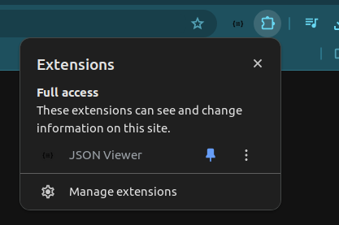

# Seção 20: Spring Boot

## Aula 01 - Criar Projeto Spring Boot:
Vamos, por começo, configurar um projeto Spring Boot.

Para isso, é necessário visitarmos o seguinte site

    https://start.spring.io/

Nela iremos preencher um formulário para configurarmo o nosso projeto. Logo, seguiremos com a seguinte instrução

- Project: Maven

- Language: Java

- Spring Boot: Deixa na versão selecionada por padrão

- Project Metadata:

    Group: é onde se coloca o domínio da empresa vou inventar "jp.com.mathcoder"

    Antifact: exercicios-sboot

    Name: exercicios-sboot

    Description: Exercícios de Spring Boot

    Package name: jp.com.mathcoder.exerciciossboot

    Packaging: Jar

    Java: Deixar na opção padrão (Selecionei a versão que está instalado na minha máquina)

- Dependencies:

    Spring Boot Dev Tools

    Spring Web

Feito os preenchimentos de formulários acima, então clicamos em "Generate".

Isso irá baixar uma pasta .zip, e descompactamos ela na pasta Download e movemos essa pasta dentro do WorkSpace, curso-java.

Agora, só falta importarmos esse projeto dentro do eclipse.

## Aula 02 - Importando Projeto Maven:
Vamos, agora, importar esse projeto, exercicios-sb, dentro do eclipse.

Para isso, no eclipse, realizamos os seguinte passo a passo

    botão direito -> import -> Maven -> Existing Maven Project -> Next -> Procura pela pasta "exercicios-sb" -> Abrir/Open -> Finish

Bom, dessa forma, importamos o nosso projeto Maven.

Note que, dentro do projeto, exercicios-sb, na pasta, Maven Dependecies, já vem com muita, mas muita, dependências pronto para serem usadas.

Bom, o Maven, o seu conceito não é o foco da abordagem do curso, mas precisamos saber o mínimo para conseguirmos entender as configurações.

Na próxima aula, iremos realizar tais abordagens.

## Aula 03 - Maven & POM.XML:
Vamos te passar mais um pouco sobre o que é Maven e POM.xml.

Lembrando que não é um assunto principal para abordarmos nessa seção. Então, deixaremos algumas referências no final dessa aula para que o estudante consiga consultar.

Existe um arquivo, POM.xml, que é um arquivo de configuração de maven que nos trás um conjunto de informações. São elas:

- Informações do Projeto

- Dependências do projeto

- Plugins

Agora, temos o gerenciador de dependências, donde é consultado na nuvem para baixar todas a dependências que precisamos, na sua maioria são arquivos do tipo .jar.

Temos, também, o ciclo de vida que é o processo de realizar o build da aplicação que, a grosso modo, são

     compilação -> teste -> instalação

Que é o processo de geração de pacote para podermos lançar na produção. No caso, é nessa fase que os plugins cumprem um papel importante, pois para cada fase, das três citadas acima, esses plugins são chamados.

Basicamente, o arquivo, POM.xml, é como se fosse o arquivo package-json.json, onde está as dependências que um projeto precisa e que é usado o "npm" para conseguirmos baixar as dependências necessárias para rodarmos o projeto em outras máquinas.

Baiscamente, o arquivo, POM.xml, servem para conseguirmos realizar as personalizações para o projeto.

Seguir link:

    https://www.devmedia.com.br/gerenciando-projetos-com-maven/10823#:~:text=Introdu%C3%A7%C3%A3o%20ao%20Apache%20Maven%3A,compilar%20e%20distribuir%20uma%20aplica%C3%A7%C3%A3o.

    https://www.semeru.com.br/blog/entendendo-o-pom-do-maven/

    https://stackoverflow.com/questions/3589562/why-maven-what-are-the-benefits

    https://www.simplilearn.com/tutorials/maven-tutorial/what-is-maven

    https://maven.apache.org/plugins/maven-javadoc-plugin/plugin-info.html

    https://maven.apache.org/guides/getting-started/

## Aula 04 - Executar Projeto Spring Boot:
No projeto, exercicios-sb, da pasta "src/main/java" dentro dela haverá um pacote, jp.com.mathcoder.exerciciossb, e dentro desse pacote teremos a classe, ExerciciosSbootApplication.java.

Para executarmos o nosso projeto, bastaria rodar a classe acima de forma usual como ramos uma classe, usando o "run".

No final, a confirmação de que o Sprring Boot ele está funcionando irá ser exibido a porta em que estará rodando, do localhost

    2024-02-25T20:10:30.094-03:00  INFO 34754 --- [  restartedMain] o.s.b.w.embedded.tomcat.TomcatWebServer  : Tomcat initialized with port 8080 (http)

Assim, abrindo uma navegador e se digitarmos

    http://localhost:8080/

Se aparecer uma msg

    Whitelabel Error Page
    This application has no explicit mapping for /error, so you are seeing this as a fallback.

    Sun Feb 25 20:15:28 BRT 2024
    There was an unexpected error (type=Not Found, status=404).
    No static resource .

Significa que o nosso projeto está rodando.

Obs: No meu casso, não só apareceu a msg acima, mas o seguinte erro

    org.springframework.web.servlet.resource.NoResourceFoundException: No static resource .
        at org.springframework.web.servlet.resource.ResourceHttpRequestHandler.handleRequest(ResourceHttpRequestHandler.java:585)
        at org.springframework.web.servlet.mvc.HttpRequestHandlerAdapter.handle(HttpRequestHandlerAdapter.java:52)
        at org.springframework.web.servlet.DispatcherServlet.doDispatch(DispatcherServlet.java:1089)
        at org.springframework.web.servlet.DispatcherServlet.doService(DispatcherServlet.java:979)
        at org.springframework.web.servlet.FrameworkServlet.processRequest(FrameworkServlet.java:1014)
        at org.springframework.web.servlet.FrameworkServlet.doGet(FrameworkServlet.java:903)
        at jakarta.servlet.http.HttpServlet.service(HttpServlet.java:564)
        at org.springframework.web.servlet.FrameworkServlet.service(FrameworkServlet.java:885)
        at jakarta.servlet.http.HttpServlet.service(HttpServlet.java:658)
        at org.apache.catalina.core.ApplicationFilterChain.internalDoFilter(ApplicationFilterChain.java:205)
        at org.apache.catalina.core.ApplicationFilterChain.doFilter(ApplicationFilterChain.java:149)
        at org.apache.tomcat.websocket.server.WsFilter.doFilter(WsFilter.java:51)
        at org.apache.catalina.core.ApplicationFilterChain.internalDoFilter(ApplicationFilterChain.java:174)
        at org.apache.catalina.core.ApplicationFilterChain.doFilter(ApplicationFilterChain.java:149)
        at org.springframework.web.filter.RequestContextFilter.doFilterInternal(RequestContextFilter.java:100)
        at org.springframework.web.filter.OncePerRequestFilter.doFilter(OncePerRequestFilter.java:116)
        at org.apache.catalina.core.ApplicationFilterChain.internalDoFilter(ApplicationFilterChain.java:174)
        at org.apache.catalina.core.ApplicationFilterChain.doFilter(ApplicationFilterChain.java:149)
        at org.springframework.web.filter.FormContentFilter.doFilterInternal(FormContentFilter.java:93)
        at org.springframework.web.filter.OncePerRequestFilter.doFilter(OncePerRequestFilter.java:116)
        at org.apache.catalina.core.ApplicationFilterChain.internalDoFilter(ApplicationFilterChain.java:174)
        at org.apache.catalina.core.ApplicationFilterChain.doFilter(ApplicationFilterChain.java:149)
        at org.springframework.web.filter.CharacterEncodingFilter.doFilterInternal(CharacterEncodingFilter.java:201)
        at org.springframework.web.filter.OncePerRequestFilter.doFilter(OncePerRequestFilter.java:116)
        at org.apache.catalina.core.ApplicationFilterChain.internalDoFilter(ApplicationFilterChain.java:174)
        at org.apache.catalina.core.ApplicationFilterChain.doFilter(ApplicationFilterChain.java:149)
        at org.apache.catalina.core.StandardWrapperValve.invoke(StandardWrapperValve.java:167)
        at org.apache.catalina.core.StandardContextValve.invoke(StandardContextValve.java:90)
        at org.apache.catalina.authenticator.AuthenticatorBase.invoke(AuthenticatorBase.java:482)
        at org.apache.catalina.core.StandardHostValve.invoke(StandardHostValve.java:115)
        at org.apache.catalina.valves.ErrorReportValve.invoke(ErrorReportValve.java:93)
        at org.apache.catalina.core.StandardEngineValve.invoke(StandardEngineValve.java:74)
        at org.apache.catalina.connector.CoyoteAdapter.service(CoyoteAdapter.java:344)
        at org.apache.coyote.http11.Http11Processor.service(Http11Processor.java:391)
        at org.apache.coyote.AbstractProcessorLight.process(AbstractProcessorLight.java:63)
        at org.apache.coyote.AbstractProtocol$ConnectionHandler.process(AbstractProtocol.java:896)
        at org.apache.tomcat.util.net.NioEndpoint$SocketProcessor.doRun(NioEndpoint.java:1744)
        at org.apache.tomcat.util.net.SocketProcessorBase.run(SocketProcessorBase.java:52)
        at org.apache.tomcat.util.threads.ThreadPoolExecutor.runWorker(ThreadPoolExecutor.java:1191)
        at org.apache.tomcat.util.threads.ThreadPoolExecutor$Worker.run(ThreadPoolExecutor.java:659)
        at org.apache.tomcat.util.threads.TaskThread$WrappingRunnable.run(TaskThread.java:63)
        at java.base/java.lang.Thread.run(Thread.java:1583)

No caso, o que fiz para resolver esse problema foi o seguinte

    @RequestMapping(method = RequestMethod.GET, path = "ola")

## Aula 05 - Aviso sobre a versão do SpringBoot:
E aí, pessoal! Tudo bem?

Partindo do pressuposto que vocês criaram o projeto com a versão mais atualizada do Spring Boot, o código feito na versão mais atualizada não vai funcionar como o código do professor Leonardo da aula a seguir. Por causa de divergência de versões está gerando um resultado diferente atualmente no método @ResquestMapping. Para evitar o problema, nós sugerimos que usem a versão 2.7.8 do Spring Boot, caso queiram continuar com as versões superiores, basta continuar a aula que no final dela quando o professor Leonardo especificar o método e o path dessa forma @RequestMapping(method = RequestMethod.GET, path = "ola") irá funcionar normalmente.

Caso queiram mudar a versão, basta ir no pom.xml e mudar o conteúdo da tag version para 2.7.8 igual na imagem a seguir.

    <parent>

        <groupId>org.springframework.boot</groupId>

        <artifactId>spring-boot-starter-parent</artifactId>

        <version>2.7.8</version>

        <relativePath/>

    </parent>

Feito quaisquer dessas soluções, o projeto estará funcionando normalmente.

Bons estudos!

## Aula 06 - Primeiro Web Service:
Vamos, agora, criar o nosso primeiro web service.

Bom, vamos criar um novo pacote, jp.com.mathcoder.exerciciossboot.controllers, dentro do pacote, jp.com.mathcoder.exerciciossboot, e dentro desse pacote, vamos criar a nossa nova classe, PrimeiroController, e nela inserimos o seguinte

    package jp.com.mathcoder.exerciciossboot.controllers;

    public class PrimeiroController {

        public String ola() {
            return "Olá Spring Boot!";
        }
    }

Vamos, agora, precisar mapear a execução desse método acima para alguma url dentro da nossa aplicação.

Para isso, primeiro, na classe que criamos acima, vamos colocar uma anotação que considera a classe acima um tipo rest do controller, da seguinte forma

    package jp.com.mathcoder.exerciciossboot.controllers;

    import org.springframework.web.bind.annotation.RestController;

    @RestController
    public class PrimeiroController {

        public String ola() {
            return "Olá Spring Boot!";
        }
    }

Em seguida, vamos usar o "RequestMapping" em cima do método que foi criado, pois isso é o que irá fornecer o reconhecimento da execução do método no navegador. E nela irá mostrar o que esse método estará retornando, caso tenha executado de forma correta.

Bom, visto que foi mapeado a url acima, o conceito por trás do que aplicamos acima, está em exatamente no padrão "method = RequestMethod.GET" definido pelo "RequestMapping", que tem haver com um assunto sobre o protocolo HTTP que será abordado mais para frente. Por hora, aplicando o conceito acima no nosso código abaixo

    package jp.com.mathcoder.exerciciossboot.controllers;

    import org.springframework.web.bind.annotation.RequestMapping;
    import org.springframework.web.bind.annotation.RequestMethod;
    import org.springframework.web.bind.annotation.RestController;

    @RestController
    public class PrimeiroController {

        @RequestMapping(method = RequestMethod.GET)
        public String ola() {
            return "Olá Spring Boot!";
        }
    }

Ao rodarmos no navegador, localhost:8080, veremos que a msg de texto do método, ola, foi exibido de forma bem feita.

Agora, se quisermos que o método, ola, que temos acima seja executado por via de uma path que requisitamos via url? Ou seja, quero que o método acima seja executado, somente, quando chamo a path, localhost:8080/ola, no navegador. Para isso, vamos colocar o path dentro do "RequestMapping" da seguinte forma

    package jp.com.mathcoder.exerciciossboot.controllers;

    import org.springframework.web.bind.annotation.RequestMapping;
    import org.springframework.web.bind.annotation.RequestMethod;
    import org.springframework.web.bind.annotation.RestController;

    @RestController
    public class PrimeiroController {

        @RequestMapping(method = RequestMethod.GET, path = "/ola")
        public String ola() {
            return "Olá Spring Boot!";
        }
    }

Ou seja, o que signinfica, depois que colocarmos a path acima? Significa que se chegar um tipo de requisição, GET, dentro da path, localhost:8080/ola, será executado o método, ola, que foi definido na classe acima.

Como prova disso, note que, ao rodarmos o nosso projeto Spring Boot, na path, localhost:8080, que é a página principal/main, será exibido, novamente, a msg de texto de erro que foi exibido na última aula. Entretanto, ao batermos no link, localhost:8080/ola, vamos ver que será exibido a msg de texto do método, ola, que definimos na classe, PrimeiroController.

Temos uma outra forma que já determina o tipo de request que estaremos realizando sobre um método que fizemos acima manualmente, dizendo que ela deve ser feito via GET. Seria o GetMapping, da seguinte forma

    package jp.com.mathcoder.exerciciossboot.controllers;

    import org.springframework.web.bind.annotation.GetMapping;
    import org.springframework.web.bind.annotation.RestController;

    @RestController
    public class PrimeiroController {

        @GetMapping
        public String ola() {
            return "Olá Spring Boot!";
        }
    }

Claro, visto que não definimos a path acima, ao batermos no link, localhost:8080, iremos ver que o método, ola, foi executado como um GET e será exibido a msg de texto que foi definido nela. Bom, caso quisermos colocar alguma path, na anotação acima, basta realizarmos da mesma forma como fizemos para a anotação, RequestMapping, como seguinte

    package jp.com.mathcoder.exerciciossboot.controllers;

    import org.springframework.web.bind.annotation.GetMapping;
    import org.springframework.web.bind.annotation.RestController;

    @RestController
    public class PrimeiroController {

        @GetMapping(path = "/ola")
        public String ola() {
            return "Olá Spring Boot!";
        }
    }

Assim, ao batermos o link, localhost:8080/ola, vamos conseguir verificar que o método, ola, foi executado com a requisição GET na path, localhost:8080/ola.

Podemos, também, definir um conjunto de path onde o mesmo método seja executado, definindo as paths como um array dentro do atributo, path, da notação, GetMapping, da seguinte forma

    package jp.com.mathcoder.exerciciossboot.controllers;

    import org.springframework.web.bind.annotation.GetMapping;
    import org.springframework.web.bind.annotation.RestController;

    @RestController
    public class PrimeiroController {

        @GetMapping(path = {"/ola", "/hello", "/howdy"})
        public String ola() {
            return "Olá Spring Boot!";
        }
    }

Ou seja, na forma como definimos acima, significa que se visitarmos quaisquer uma das seguintes paths, localhost:8080/ola, localhost:8080/hello ou localhost:8080/howdy, o método, ola, será executado como uma requisição, GET.

## Aula 07 - Simulando Erros:
Antes de simularmos alguns erros úteis, queremos trazer um detalhe interessante quando rodamos o nosso Spring Boot com o nosso primeiro web service de aplicação que fizemos na aula antecessora.

Note que, na classe que já vem definido por padrão do projeto spring boot, ExerciciosSbootApplication.java, que definimos no início dessa seção, vimos que, para que consigamos rodar a nossa classe, PrimeiroController, não precisamos realizar nenhuma alteração dessa classe padrão que nos permite rodar e visualizar o projeto no navegador local. Isso se deve ao fato da marcação, RequestController, que colocamos na classe, PrimeiroController, que fez com que ela seja reconhecido automaticamente, sem a necessidade de implementarmos alguma alteração dentro da classe, ExerciciosSbootApplication.java. Claro, não é somente a notação, RestController, que o spring encontra, mas, sim, generalizando a partir desse exemplo particular que aplicamos na última aula, existe um conjunto de notações que o spring reconhece de forma que não seja necessário implementarmos alguma alteração dentro da classe padrão, ExerciciosSbootApplication.java, que ela consegue reconhecer no momento em que é executado o projeto.

Isso nos mostra a facilidade que temos no uso do Spring Boot, que é através dessas notações/marcações que nos permite controlarmos qual classe deverá ser executado de qual forma com menos código possível.

Agora, levando em consideração à classe, PrimeiroController, que criamos na aula antecessora, se fizermos da seguinte forma

    package jp.com.mathcoder.exerciciossboot.controllers;

    import org.springframework.web.bind.annotation.GetMapping;
    import org.springframework.web.bind.annotation.RestController;

    @RestController
    public class PrimeiroController {

        @GetMapping(path = {"/ola", "/saudacao"})
        public String ola() {
            return "Olá Spring Boot!";
        }
        
        @GetMapping(path = "/saudacao")
        public String saudacao() {
            return "Olá Spring Boot!";
        }
    }

Ou seja, criamos um outro método onde está sendo puxado a mesma path, /saudacao, com métodos que diferem só no nome. Isso nos fornecerá um problema de ambiguidade.

Entrando, agora, de fato, na abordagem sobre erro em questão, sobre a ambiguidade. Será exibido na aplicação, ao batermos no link, localhost:8080/saudacao, a seguinte msg de erro

    Ambiguous handler methods mapped for '/saudacao': {public java.lang.String jp.com.mathcoder.exerciciossboot.controllers.PrimeiroController.saudacao(), public java.lang.String jp.com.mathcoder.exerciciossboot.controllers.PrimeiroController.ola()}
    java.lang.IllegalStateException: Ambiguous handler methods mapped for '/saudacao': {public java.lang.String jp.com.mathcoder.exerciciossboot.controllers.PrimeiroController.saudacao(), public java.lang.String jp.com.mathcoder.exerciciossboot.controllers.PrimeiroController.ola()}

Bom, note que, esse erro, ela se deve não por ter requisitado uma path com o mesmo nome, mas, sim, por conta do tipo de requisição que executamos sobre ela, que é o, GetMapping. Como prova disso, ao mudarmos a marcação, GetMappging, do método, saudacao, para, PostMapping, mas mantendo a path, saudacao, veremos que ambos os métodos foram executados, da seguinte forma

    package jp.com.mathcoder.exerciciossboot.controllers;

    import org.springframework.web.bind.annotation.GetMapping;
    import org.springframework.web.bind.annotation.PostMapping;
    import org.springframework.web.bind.annotation.RestController;

    @RestController
    public class PrimeiroController {

        @GetMapping(path = {"/ola", "/saudacao"})
        public String ola() {
            return "Olá Spring Boot!";
        }
        
        @PostMapping(path = "/saudacao")
        public String saudacao() {
            return "Olá Spring Boot (POST)!";
        }
    }

Note que, quando batermos no link, localhost:8080/saudacao, vamos ver que só foi exibido a msg do método, ola, que está sobre a requisicao, GET. Do ponto de vista conceitual, é claro, pois quando pedimos ao navegador rodar o nosso projeto, o que é exibido na tela de aplicação dela é feito via GET. Não fizemos nenhuma ação via front ou back que execute a requisição POST.

Como prova disso, se tirarmos a path, saudacao, da lista de path do método, ola

    package jp.com.mathcoder.exerciciossboot.controllers;

    import org.springframework.web.bind.annotation.GetMapping;
    import org.springframework.web.bind.annotation.PostMapping;
    import org.springframework.web.bind.annotation.RestController;

    @RestController
    public class PrimeiroController {

        @GetMapping(path = "/ola")
        public String ola() {
            return "Olá Spring Boot!";
        }
        
        @PostMapping(path = "/saudacao")
        public String saudacao() {
            return "Olá Spring Boot (POST)!";
        }
    }

e tentarmos, novamente, bater no link, localhost:8080/saudacao, pelo navegador, será exibido a seguinte msg de erro

    There was an unexpected error (type=Method Not Allowed, status=405).
    Method 'GET' is not supported.
    org.springframework.web.HttpRequestMethodNotSupportedException: Request method 'GET' is not supported

Ou seja, foi reconhecido a existência de um método com a requisição, GET, dentro da classe, PrimeiroController, porém na path que foi definido, saudacao, não foi suportado.

Bom, o que eu queria que o estudante entendesse nessa aula, seria sobre a maneira como analisamos os erros e a sua relação com os conceitos por baixo do pano que está sendo definido para conseguirmos ter mais calma na sua análise.

Isso é por conta do fato de que, quanto mais implementações formos colocar dentro do projeto, mais e mais o projeto aumenta em sua complexidade, donde quando é fornecido um erro, muitas vezes, o erro exibido na tela, não necessariamente mostra a sua causa raiz. Ou seja, um erro poderia ser gerado por conta de um outro erro, que este foi gerado por um outro erro, e assim sucessivamente. No caso, o estudante precisaria aumentar a sua skills de analisar a lógica de programação para conseguir realizar uma análise de causa raiz da origem de um determinado erro que foi gerado.

Bom, basicamente, no cenário em que abordamos, mostramos que mapear dois métodos para uma mesma url não pode, visto o tipo de requisição HTTP são iguais, porém, para requisições diferentes, podemos, sim, mapear dois métodos para a mesma URL.

## Aula 08 - Web Service Retornando Objeto:
Vamos, agora, verificar o que acontece quando, em vez de uma String, retornarmos um objeto dentro de um método do Spring Boot.

Ou seja, até agora, na classe, PrimeiroController, do método, ola, retornamos um texto. Se retornarmos um objeto o que será que vai acontecer?

Para isso, vamos realizar os seguintes preparativos. Criamos um novo pacote, jp.com.mathcoder.exerciciossboot.models, dentro do pacote, jp.com.mathcoder.exerciciossboot, e nesse novo pacote criamos uma nova classe, Cliente, e realizamos a seguinte implementação

    package jp.com.mathcoder.exerciciossboot.models;

    public class Cliente {

        private int id;
        private String nome;
        private String cpf;
        
        public Cliente(int id, String nome, String cpf) {
            super();
            this.id = id;
            this.nome = nome;
            this.cpf = cpf;
        }

        public int getId() {
            return id;
        }

        public void setId(int id) {
            this.id = id;
        }

        public String getNome() {
            return nome;
        }

        public void setNome(String nome) {
            this.nome = nome;
        }

        public String getCpf() {
            return cpf;
        }

        public void setCpf(String cpf) {
            this.cpf = cpf;
        }
        
    }

Agora, dentro do pacote, jp.com.mathcoder.exerciciossboot.controllers, vamos criar uma nova classe, ClienteController, e nela realizamos a seguinte implementação

    package jp.com.mathcoder.exerciciossboot.controllers;

    import jp.com.mathcoder.exerciciossboot.models.Cliente;

    public class ClienteController {

        public Cliente obterCliente() {
            return new Cliente(28, "Pedro", "123.456.789-10");
        }
    }

Agora, vamos colocar as anotações para que o Spring reconheça a maneira como essa classe deve ser executada.

Então, colocamos as marcações da seguinte forma

    package jp.com.mathcoder.exerciciossboot.controllers;

    import org.springframework.web.bind.annotation.GetMapping;
    import org.springframework.web.bind.annotation.RestController;

    import jp.com.mathcoder.exerciciossboot.models.Cliente;

    @RestController
    public class ClienteController {

        @GetMapping(path = "/clientes/qualquer")
        public Cliente obterCliente() {
            return new Cliente(28, "Pedro", "123.456.789-10");
        }
    }

Agora, vamos bater no link, localhost:8080/clientes/qualquer, e vemos o que é exibido na aplicação.

Note que, foi devolvido um objeto em forma de Json da seguinte forma

    {"id":28,"nome":"Pedro","cpf":"123.456.789-10"}

Que é um formato chamado, JSON, que é uma forma de identação de objetos que é muito usado nos dias atuais pela sua alta utilidade.

Inclusive podemos instalar uma extensão no seu navegador Chrome para termos a melhor visualização de um objeto tipo JSON, chamado JSON Viewer

    https://chromewebstore.google.com/detail/json-viewer/gbmdgpbipfallnflgajpaliibnhdgobh?hl=pt-BR

Feito a instalação da extensão acima, podemos tornar ela exibido, clicando no ícone de puzzle, como segue na imagem abaixo

Assim, irá mostrar um alfinete/Pin desmarcado e bastaria marcar como na imagem abaixo

Assim, irá exibir a extensão JSON Viewer.

Note que, quando abrimos alguma navegador que não temos nenhum uso desse JSON, essa extensão fica inativa, porém, quando entramos em um navegador que utiliza da exibição em formato de JSON, a extensão ativa automaticamente.

    // 20240310173726
    // http://localhost:8080/clientes/qualquer

    {
    "id": 28,
    "nome": "Pedro",
    "cpf": "123.456.789-10"
    }

Agora, lembra quando aplicamos a marcação, RequestMapping, sobre um método? 

Essa marcação, podemos realizar sobre a classe da seguinte forma

    package jp.com.mathcoder.exerciciossboot.controllers;

    import org.springframework.web.bind.annotation.GetMapping;
    import org.springframework.web.bind.annotation.RequestMapping;
    import org.springframework.web.bind.annotation.RestController;

    import jp.com.mathcoder.exerciciossboot.models.Cliente;

    @RestController
    @RequestMapping(path = "/clientes")
    public class ClienteController {

        @GetMapping(path = "/clientes/qualquer")
        public Cliente obterCliente() {
            return new Cliente(28, "Pedro", "123.456.789-10");
        }
    }

Ou seja, a marcação, RequestMapping, acima nos torna claro que a path, clientes, será a path principal dessa classe e todos os métodos que definirmos dentro dessa classe, estará confinados dentro dessa path. De modo que, podemos tirar, /clientes, dentro da path que foi definido sobre o método, obterCliente, como segue

    package jp.com.mathcoder.exerciciossboot.controllers;

    import org.springframework.web.bind.annotation.GetMapping;
    import org.springframework.web.bind.annotation.RequestMapping;
    import org.springframework.web.bind.annotation.RestController;

    import jp.com.mathcoder.exerciciossboot.models.Cliente;

    @RestController
    @RequestMapping(path = "/clientes")
    public class ClienteController {

        @GetMapping(path = "/qualquer")
        public Cliente obterCliente() {
            return new Cliente(28, "Pedro", "123.456.789-10");
        }
    }

Ou seja, a path, /qualquer, que definimos sobre o método, obterCliente, visto que a path, /clientes, foi definido sobre a classe, ClienteController, irá significar o seguinte, /clientes/qualquer. Logo, no navegador, para que o método seja executado, teremos que bater no link, localhost:8080/clientes/qualquer.

Bom, não necessariamente, é preciso colocar o atributo "path" dentro da marcação para conseguirmos definir a path. Bastaria colocar o nome da path, como segue, que irá funcionar da mesma forma

    package jp.com.mathcoder.exerciciossboot.controllers;

    import org.springframework.web.bind.annotation.GetMapping;
    import org.springframework.web.bind.annotation.RequestMapping;
    import org.springframework.web.bind.annotation.RestController;

    import jp.com.mathcoder.exerciciossboot.models.Cliente;

    @RestController
    @RequestMapping("/clientes")
    public class ClienteController {

        @GetMapping("/qualquer")
        public Cliente obterCliente() {
            return new Cliente(28, "Pedro", "123.456.789-10");
        }
    }

## Aula 09 - Formato JSON:

Seguir o link:

    https://jsonformatter.curiousconcept.com/

## Aula 10 - Métodos HTTP #01:

## Aula 11 - Métodos HTTP #02:

## Aula 12 - Usando Postman:

## Aula 13 - Passando Parâmetros para Web Service #01:

## Aula 14 - Passando Parâmetros para Web Service #02:

## Aula 15 - Desafio Web Service Calculadora:

## Aula 16 - Desafio Web Service Calculadora - Resposta:

## Aula 17 - Próxima Aula: Padrão MVC:

## Aula 18 - Padrão MVC (Model - View - Controller):

## Aula 19 - Padrão MVC & Spring Boot:

## Aula 20 - Artigo: Configuração JPA:

## Aula 21 - Configuração JPA:

## Aula 22 - Inserir Produto #01:

## Aula 23 - Inserir Produto #02:

## Aula 24 - Injeção de Dependência:

## Aula 25 - Desafio Novo Atributos:

## Aula 26 - Desafio Novo Atributos - Resposta:

## Aula 27 - Simplificando Inserir Produto:

## Aula 28 - Um aviso sobre a próxima aula:

## Aula 29 - Aplicando Validações Simples:

## Aula 30 - Consultando Todos os Produtos:

## Aula 31 - Consultando Produtos por ID:

## Aula 32 - Alterando o Produto #01:

## Aula 33 - Alterando o Produto #02:

## Aula 34 - Excluindo o Produto por ID:

## Aula 35 - Consulta Paginada:

## Aula 36 - Consulta de Produto por Nome:

## Aula 37 - Mais Consultas:
