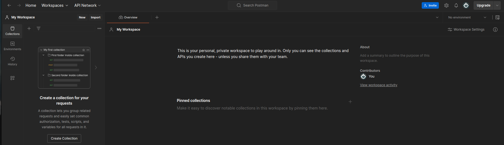
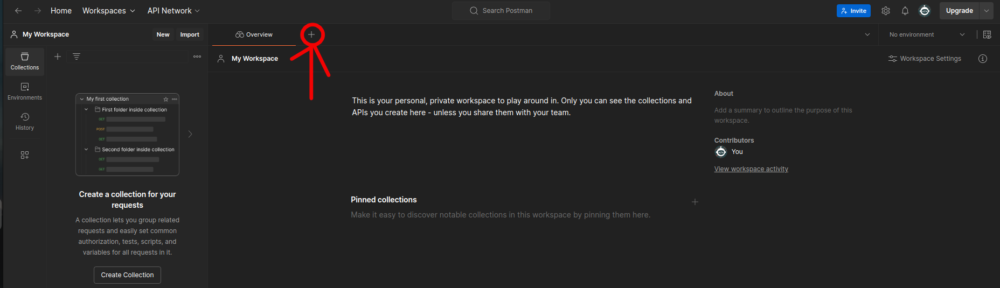
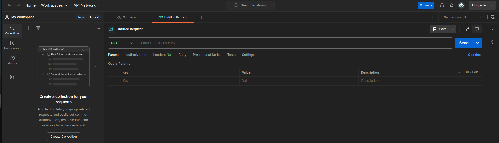
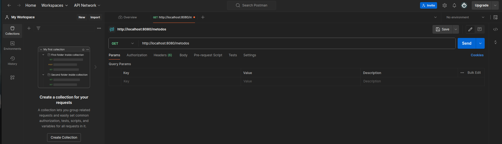
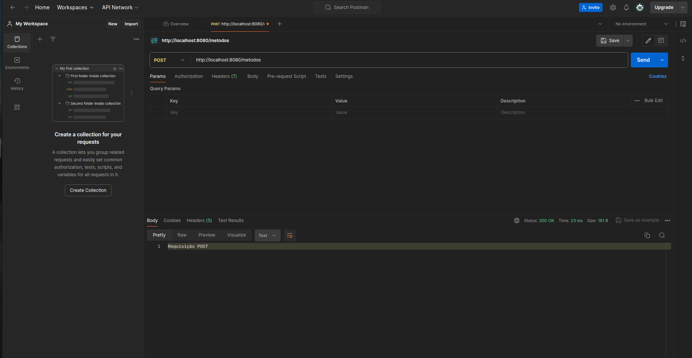
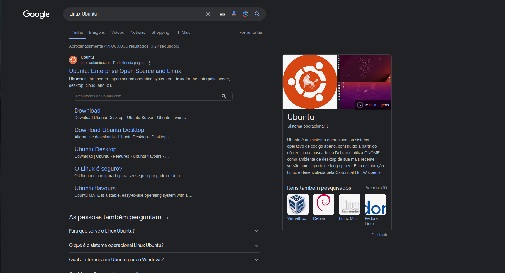
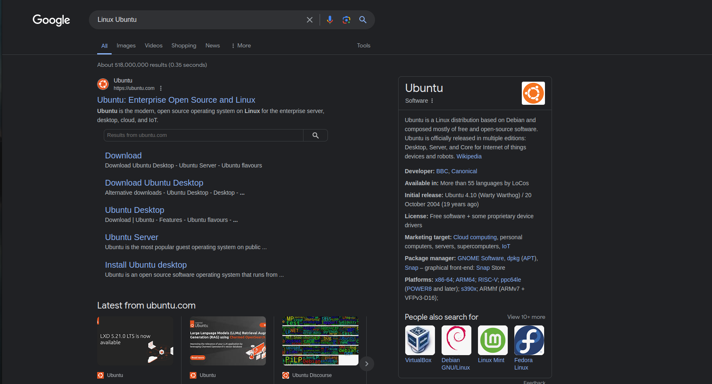
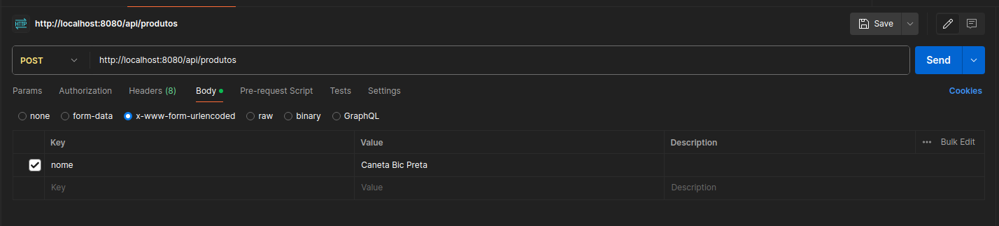
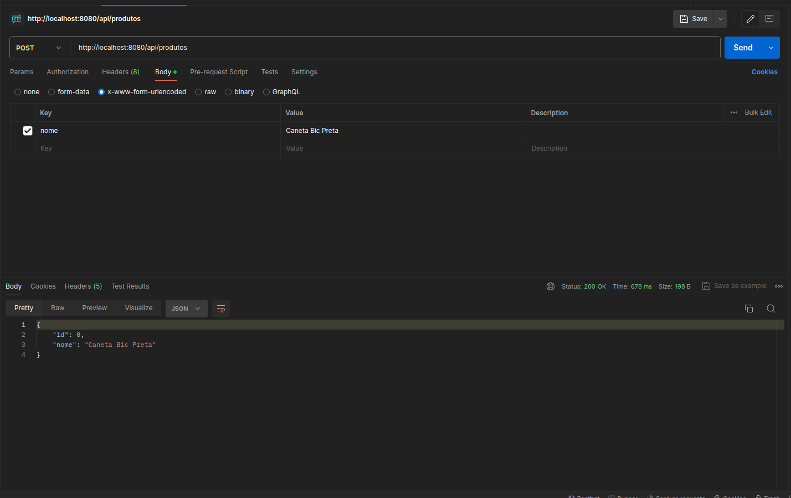
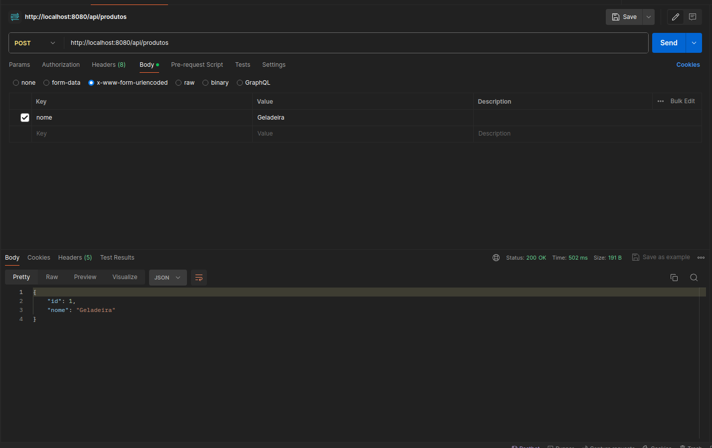

# Seção 20: Spring Boot

## Aula 01 - Criar Projeto Spring Boot:
Vamos, por começo, configurar um projeto Spring Boot.

Para isso, é necessário visitarmos o seguinte site

    https://start.spring.io/

Nela iremos preencher um formulário para configurarmo o nosso projeto. Logo, seguiremos com a seguinte instrução

- Project: Maven

- Language: Java

- Spring Boot: Deixa na versão selecionada por padrão

- Project Metadata:

    Group: é onde se coloca o domínio da empresa vou inventar "jp.com.mathcoder"

    Antifact: exercicios-sboot

    Name: exercicios-sboot

    Description: Exercícios de Spring Boot

    Package name: jp.com.mathcoder.exerciciossboot

    Packaging: Jar

    Java: Deixar na opção padrão (Selecionei a versão que está instalado na minha máquina)

- Dependencies:

    Spring Boot Dev Tools

    Spring Web

Feito os preenchimentos de formulários acima, então clicamos em "Generate".

Isso irá baixar uma pasta .zip, e descompactamos ela na pasta Download e movemos essa pasta dentro do WorkSpace, curso-java.

Agora, só falta importarmos esse projeto dentro do eclipse.

## Aula 02 - Importando Projeto Maven:
Vamos, agora, importar esse projeto, exercicios-sb, dentro do eclipse.

Para isso, no eclipse, realizamos os seguinte passo a passo

    botão direito -> import -> Maven -> Existing Maven Project -> Next -> Procura pela pasta "exercicios-sb" -> Abrir/Open -> Finish

Bom, dessa forma, importamos o nosso projeto Maven.

Note que, dentro do projeto, exercicios-sb, na pasta, Maven Dependecies, já vem com muita, mas muita, dependências pronto para serem usadas.

Bom, o Maven, o seu conceito não é o foco da abordagem do curso, mas precisamos saber o mínimo para conseguirmos entender as configurações.

Na próxima aula, iremos realizar tais abordagens.

## Aula 03 - Maven & POM.XML:
Vamos te passar mais um pouco sobre o que é Maven e POM.xml.

Lembrando que não é um assunto principal para abordarmos nessa seção. Então, deixaremos algumas referências no final dessa aula para que o estudante consiga consultar.

Existe um arquivo, POM.xml, que é um arquivo de configuração de maven que nos trás um conjunto de informações. São elas:

- Informações do Projeto

- Dependências do projeto

- Plugins

Agora, temos o gerenciador de dependências, donde é consultado na nuvem para baixar todas a dependências que precisamos, na sua maioria são arquivos do tipo .jar.

Temos, também, o ciclo de vida que é o processo de realizar o build da aplicação que, a grosso modo, são

     compilação -> teste -> instalação

Que é o processo de geração de pacote para podermos lançar na produção. No caso, é nessa fase que os plugins cumprem um papel importante, pois para cada fase, das três citadas acima, esses plugins são chamados.

Basicamente, o arquivo, POM.xml, é como se fosse o arquivo package-json.json, onde está as dependências que um projeto precisa e que é usado o "npm" para conseguirmos baixar as dependências necessárias para rodarmos o projeto em outras máquinas.

Baiscamente, o arquivo, POM.xml, servem para conseguirmos realizar as personalizações para o projeto.

Seguir link:

    https://www.devmedia.com.br/gerenciando-projetos-com-maven/10823#:~:text=Introdu%C3%A7%C3%A3o%20ao%20Apache%20Maven%3A,compilar%20e%20distribuir%20uma%20aplica%C3%A7%C3%A3o.

    https://www.semeru.com.br/blog/entendendo-o-pom-do-maven/

    https://stackoverflow.com/questions/3589562/why-maven-what-are-the-benefits

    https://www.simplilearn.com/tutorials/maven-tutorial/what-is-maven

    https://maven.apache.org/plugins/maven-javadoc-plugin/plugin-info.html

    https://maven.apache.org/guides/getting-started/

## Aula 04 - Executar Projeto Spring Boot:
No projeto, exercicios-sb, da pasta "src/main/java" dentro dela haverá um pacote, jp.com.mathcoder.exerciciossb, e dentro desse pacote teremos a classe, ExerciciosSbootApplication.java.

Para executarmos o nosso projeto, bastaria rodar a classe acima de forma usual como ramos uma classe, usando o "run".

No final, a confirmação de que o Sprring Boot ele está funcionando irá ser exibido a porta em que estará rodando, do localhost

    2024-02-25T20:10:30.094-03:00  INFO 34754 --- [  restartedMain] o.s.b.w.embedded.tomcat.TomcatWebServer  : Tomcat initialized with port 8080 (http)

Assim, abrindo uma navegador e se digitarmos

    http://localhost:8080/

Se aparecer uma msg

    Whitelabel Error Page
    This application has no explicit mapping for /error, so you are seeing this as a fallback.

    Sun Feb 25 20:15:28 BRT 2024
    There was an unexpected error (type=Not Found, status=404).
    No static resource .

Significa que o nosso projeto está rodando.

Obs: No meu casso, não só apareceu a msg acima, mas o seguinte erro

    org.springframework.web.servlet.resource.NoResourceFoundException: No static resource .
        at org.springframework.web.servlet.resource.ResourceHttpRequestHandler.handleRequest(ResourceHttpRequestHandler.java:585)
        at org.springframework.web.servlet.mvc.HttpRequestHandlerAdapter.handle(HttpRequestHandlerAdapter.java:52)
        at org.springframework.web.servlet.DispatcherServlet.doDispatch(DispatcherServlet.java:1089)
        at org.springframework.web.servlet.DispatcherServlet.doService(DispatcherServlet.java:979)
        at org.springframework.web.servlet.FrameworkServlet.processRequest(FrameworkServlet.java:1014)
        at org.springframework.web.servlet.FrameworkServlet.doGet(FrameworkServlet.java:903)
        at jakarta.servlet.http.HttpServlet.service(HttpServlet.java:564)
        at org.springframework.web.servlet.FrameworkServlet.service(FrameworkServlet.java:885)
        at jakarta.servlet.http.HttpServlet.service(HttpServlet.java:658)
        at org.apache.catalina.core.ApplicationFilterChain.internalDoFilter(ApplicationFilterChain.java:205)
        at org.apache.catalina.core.ApplicationFilterChain.doFilter(ApplicationFilterChain.java:149)
        at org.apache.tomcat.websocket.server.WsFilter.doFilter(WsFilter.java:51)
        at org.apache.catalina.core.ApplicationFilterChain.internalDoFilter(ApplicationFilterChain.java:174)
        at org.apache.catalina.core.ApplicationFilterChain.doFilter(ApplicationFilterChain.java:149)
        at org.springframework.web.filter.RequestContextFilter.doFilterInternal(RequestContextFilter.java:100)
        at org.springframework.web.filter.OncePerRequestFilter.doFilter(OncePerRequestFilter.java:116)
        at org.apache.catalina.core.ApplicationFilterChain.internalDoFilter(ApplicationFilterChain.java:174)
        at org.apache.catalina.core.ApplicationFilterChain.doFilter(ApplicationFilterChain.java:149)
        at org.springframework.web.filter.FormContentFilter.doFilterInternal(FormContentFilter.java:93)
        at org.springframework.web.filter.OncePerRequestFilter.doFilter(OncePerRequestFilter.java:116)
        at org.apache.catalina.core.ApplicationFilterChain.internalDoFilter(ApplicationFilterChain.java:174)
        at org.apache.catalina.core.ApplicationFilterChain.doFilter(ApplicationFilterChain.java:149)
        at org.springframework.web.filter.CharacterEncodingFilter.doFilterInternal(CharacterEncodingFilter.java:201)
        at org.springframework.web.filter.OncePerRequestFilter.doFilter(OncePerRequestFilter.java:116)
        at org.apache.catalina.core.ApplicationFilterChain.internalDoFilter(ApplicationFilterChain.java:174)
        at org.apache.catalina.core.ApplicationFilterChain.doFilter(ApplicationFilterChain.java:149)
        at org.apache.catalina.core.StandardWrapperValve.invoke(StandardWrapperValve.java:167)
        at org.apache.catalina.core.StandardContextValve.invoke(StandardContextValve.java:90)
        at org.apache.catalina.authenticator.AuthenticatorBase.invoke(AuthenticatorBase.java:482)
        at org.apache.catalina.core.StandardHostValve.invoke(StandardHostValve.java:115)
        at org.apache.catalina.valves.ErrorReportValve.invoke(ErrorReportValve.java:93)
        at org.apache.catalina.core.StandardEngineValve.invoke(StandardEngineValve.java:74)
        at org.apache.catalina.connector.CoyoteAdapter.service(CoyoteAdapter.java:344)
        at org.apache.coyote.http11.Http11Processor.service(Http11Processor.java:391)
        at org.apache.coyote.AbstractProcessorLight.process(AbstractProcessorLight.java:63)
        at org.apache.coyote.AbstractProtocol$ConnectionHandler.process(AbstractProtocol.java:896)
        at org.apache.tomcat.util.net.NioEndpoint$SocketProcessor.doRun(NioEndpoint.java:1744)
        at org.apache.tomcat.util.net.SocketProcessorBase.run(SocketProcessorBase.java:52)
        at org.apache.tomcat.util.threads.ThreadPoolExecutor.runWorker(ThreadPoolExecutor.java:1191)
        at org.apache.tomcat.util.threads.ThreadPoolExecutor$Worker.run(ThreadPoolExecutor.java:659)
        at org.apache.tomcat.util.threads.TaskThread$WrappingRunnable.run(TaskThread.java:63)
        at java.base/java.lang.Thread.run(Thread.java:1583)

No caso, o que fiz para resolver esse problema foi o seguinte

    @RequestMapping(method = RequestMethod.GET, path = "ola")

## Aula 05 - Aviso sobre a versão do SpringBoot:
E aí, pessoal! Tudo bem?

Partindo do pressuposto que vocês criaram o projeto com a versão mais atualizada do Spring Boot, o código feito na versão mais atualizada não vai funcionar como o código do professor Leonardo da aula a seguir. Por causa de divergência de versões está gerando um resultado diferente atualmente no método @ResquestMapping. Para evitar o problema, nós sugerimos que usem a versão 2.7.8 do Spring Boot, caso queiram continuar com as versões superiores, basta continuar a aula que no final dela quando o professor Leonardo especificar o método e o path dessa forma @RequestMapping(method = RequestMethod.GET, path = "ola") irá funcionar normalmente.

Caso queiram mudar a versão, basta ir no pom.xml e mudar o conteúdo da tag version para 2.7.8 igual na imagem a seguir.

    <parent>

        <groupId>org.springframework.boot</groupId>

        <artifactId>spring-boot-starter-parent</artifactId>

        <version>2.7.8</version>

        <relativePath/>

    </parent>

Feito quaisquer dessas soluções, o projeto estará funcionando normalmente.

Bons estudos!

## Aula 06 - Primeiro Web Service:
Vamos, agora, criar o nosso primeiro web service.

Bom, vamos criar um novo pacote, jp.com.mathcoder.exerciciossboot.controllers, dentro do pacote, jp.com.mathcoder.exerciciossboot, e dentro desse pacote, vamos criar a nossa nova classe, PrimeiroController, e nela inserimos o seguinte

    package jp.com.mathcoder.exerciciossboot.controllers;

    public class PrimeiroController {

        public String ola() {
            return "Olá Spring Boot!";
        }
    }

Vamos, agora, precisar mapear a execução desse método acima para alguma url dentro da nossa aplicação.

Para isso, primeiro, na classe que criamos acima, vamos colocar uma anotação que considera a classe acima um tipo rest do controller, da seguinte forma

    package jp.com.mathcoder.exerciciossboot.controllers;

    import org.springframework.web.bind.annotation.RestController;

    @RestController
    public class PrimeiroController {

        public String ola() {
            return "Olá Spring Boot!";
        }
    }

Em seguida, vamos usar o "RequestMapping" em cima do método que foi criado, pois isso é o que irá fornecer o reconhecimento da execução do método no navegador. E nela irá mostrar o que esse método estará retornando, caso tenha executado de forma correta.

Bom, visto que foi mapeado a url acima, o conceito por trás do que aplicamos acima, está em exatamente no padrão "method = RequestMethod.GET" definido pelo "RequestMapping", que tem haver com um assunto sobre o protocolo HTTP que será abordado mais para frente. Por hora, aplicando o conceito acima no nosso código abaixo

    package jp.com.mathcoder.exerciciossboot.controllers;

    import org.springframework.web.bind.annotation.RequestMapping;
    import org.springframework.web.bind.annotation.RequestMethod;
    import org.springframework.web.bind.annotation.RestController;

    @RestController
    public class PrimeiroController {

        @RequestMapping(method = RequestMethod.GET)
        public String ola() {
            return "Olá Spring Boot!";
        }
    }

Ao rodarmos no navegador, localhost:8080, veremos que a msg de texto do método, ola, foi exibido de forma bem feita.

Agora, se quisermos que o método, ola, que temos acima seja executado por via de uma path que requisitamos via url? Ou seja, quero que o método acima seja executado, somente, quando chamo a path, localhost:8080/ola, no navegador. Para isso, vamos colocar o path dentro do "RequestMapping" da seguinte forma

    package jp.com.mathcoder.exerciciossboot.controllers;

    import org.springframework.web.bind.annotation.RequestMapping;
    import org.springframework.web.bind.annotation.RequestMethod;
    import org.springframework.web.bind.annotation.RestController;

    @RestController
    public class PrimeiroController {

        @RequestMapping(method = RequestMethod.GET, path = "/ola")
        public String ola() {
            return "Olá Spring Boot!";
        }
    }

Ou seja, o que signinfica, depois que colocarmos a path acima? Significa que se chegar um tipo de requisição, GET, dentro da path, localhost:8080/ola, será executado o método, ola, que foi definido na classe acima.

Como prova disso, note que, ao rodarmos o nosso projeto Spring Boot, na path, localhost:8080, que é a página principal/main, será exibido, novamente, a msg de texto de erro que foi exibido na última aula. Entretanto, ao batermos no link, localhost:8080/ola, vamos ver que será exibido a msg de texto do método, ola, que definimos na classe, PrimeiroController.

Temos uma outra forma que já determina o tipo de request que estaremos realizando sobre um método que fizemos acima manualmente, dizendo que ela deve ser feito via GET. Seria o GetMapping, da seguinte forma

    package jp.com.mathcoder.exerciciossboot.controllers;

    import org.springframework.web.bind.annotation.GetMapping;
    import org.springframework.web.bind.annotation.RestController;

    @RestController
    public class PrimeiroController {

        @GetMapping
        public String ola() {
            return "Olá Spring Boot!";
        }
    }

Claro, visto que não definimos a path acima, ao batermos no link, localhost:8080, iremos ver que o método, ola, foi executado como um GET e será exibido a msg de texto que foi definido nela. Bom, caso quisermos colocar alguma path, na anotação acima, basta realizarmos da mesma forma como fizemos para a anotação, RequestMapping, como seguinte

    package jp.com.mathcoder.exerciciossboot.controllers;

    import org.springframework.web.bind.annotation.GetMapping;
    import org.springframework.web.bind.annotation.RestController;

    @RestController
    public class PrimeiroController {

        @GetMapping(path = "/ola")
        public String ola() {
            return "Olá Spring Boot!";
        }
    }

Assim, ao batermos o link, localhost:8080/ola, vamos conseguir verificar que o método, ola, foi executado com a requisição GET na path, localhost:8080/ola.

Podemos, também, definir um conjunto de path onde o mesmo método seja executado, definindo as paths como um array dentro do atributo, path, da notação, GetMapping, da seguinte forma

    package jp.com.mathcoder.exerciciossboot.controllers;

    import org.springframework.web.bind.annotation.GetMapping;
    import org.springframework.web.bind.annotation.RestController;

    @RestController
    public class PrimeiroController {

        @GetMapping(path = {"/ola", "/hello", "/howdy"})
        public String ola() {
            return "Olá Spring Boot!";
        }
    }

Ou seja, na forma como definimos acima, significa que se visitarmos quaisquer uma das seguintes paths, localhost:8080/ola, localhost:8080/hello ou localhost:8080/howdy, o método, ola, será executado como uma requisição, GET.

## Aula 07 - Simulando Erros:
Antes de simularmos alguns erros úteis, queremos trazer um detalhe interessante quando rodamos o nosso Spring Boot com o nosso primeiro web service de aplicação que fizemos na aula antecessora.

Note que, na classe que já vem definido por padrão do projeto spring boot, ExerciciosSbootApplication.java, que definimos no início dessa seção, vimos que, para que consigamos rodar a nossa classe, PrimeiroController, não precisamos realizar nenhuma alteração dessa classe padrão que nos permite rodar e visualizar o projeto no navegador local. Isso se deve ao fato da marcação, RequestController, que colocamos na classe, PrimeiroController, que fez com que ela seja reconhecido automaticamente, sem a necessidade de implementarmos alguma alteração dentro da classe, ExerciciosSbootApplication.java. Claro, não é somente a notação, RestController, que o spring encontra, mas, sim, generalizando a partir desse exemplo particular que aplicamos na última aula, existe um conjunto de notações que o spring reconhece de forma que não seja necessário implementarmos alguma alteração dentro da classe padrão, ExerciciosSbootApplication.java, que ela consegue reconhecer no momento em que é executado o projeto.

Isso nos mostra a facilidade que temos no uso do Spring Boot, que é através dessas notações/marcações que nos permite controlarmos qual classe deverá ser executado de qual forma com menos código possível.

Agora, levando em consideração à classe, PrimeiroController, que criamos na aula antecessora, se fizermos da seguinte forma

    package jp.com.mathcoder.exerciciossboot.controllers;

    import org.springframework.web.bind.annotation.GetMapping;
    import org.springframework.web.bind.annotation.RestController;

    @RestController
    public class PrimeiroController {

        @GetMapping(path = {"/ola", "/saudacao"})
        public String ola() {
            return "Olá Spring Boot!";
        }
        
        @GetMapping(path = "/saudacao")
        public String saudacao() {
            return "Olá Spring Boot!";
        }
    }

Ou seja, criamos um outro método onde está sendo puxado a mesma path, /saudacao, com métodos que diferem só no nome. Isso nos fornecerá um problema de ambiguidade.

Entrando, agora, de fato, na abordagem sobre erro em questão, sobre a ambiguidade. Será exibido na aplicação, ao batermos no link, localhost:8080/saudacao, a seguinte msg de erro

    Ambiguous handler methods mapped for '/saudacao': {public java.lang.String jp.com.mathcoder.exerciciossboot.controllers.PrimeiroController.saudacao(), public java.lang.String jp.com.mathcoder.exerciciossboot.controllers.PrimeiroController.ola()}
    java.lang.IllegalStateException: Ambiguous handler methods mapped for '/saudacao': {public java.lang.String jp.com.mathcoder.exerciciossboot.controllers.PrimeiroController.saudacao(), public java.lang.String jp.com.mathcoder.exerciciossboot.controllers.PrimeiroController.ola()}

Bom, note que, esse erro, ela se deve não por ter requisitado uma path com o mesmo nome, mas, sim, por conta do tipo de requisição que executamos sobre ela, que é o, GetMapping. Como prova disso, ao mudarmos a marcação, GetMappging, do método, saudacao, para, PostMapping, mas mantendo a path, saudacao, veremos que ambos os métodos foram executados, da seguinte forma

    package jp.com.mathcoder.exerciciossboot.controllers;

    import org.springframework.web.bind.annotation.GetMapping;
    import org.springframework.web.bind.annotation.PostMapping;
    import org.springframework.web.bind.annotation.RestController;

    @RestController
    public class PrimeiroController {

        @GetMapping(path = {"/ola", "/saudacao"})
        public String ola() {
            return "Olá Spring Boot!";
        }
        
        @PostMapping(path = "/saudacao")
        public String saudacao() {
            return "Olá Spring Boot (POST)!";
        }
    }

Note que, quando batermos no link, localhost:8080/saudacao, vamos ver que só foi exibido a msg do método, ola, que está sobre a requisicao, GET. Do ponto de vista conceitual, é claro, pois quando pedimos ao navegador rodar o nosso projeto, o que é exibido na tela de aplicação dela é feito via GET. Não fizemos nenhuma ação via front ou back que execute a requisição POST.

Como prova disso, se tirarmos a path, saudacao, da lista de path do método, ola

    package jp.com.mathcoder.exerciciossboot.controllers;

    import org.springframework.web.bind.annotation.GetMapping;
    import org.springframework.web.bind.annotation.PostMapping;
    import org.springframework.web.bind.annotation.RestController;

    @RestController
    public class PrimeiroController {

        @GetMapping(path = "/ola")
        public String ola() {
            return "Olá Spring Boot!";
        }
        
        @PostMapping(path = "/saudacao")
        public String saudacao() {
            return "Olá Spring Boot (POST)!";
        }
    }

e tentarmos, novamente, bater no link, localhost:8080/saudacao, pelo navegador, será exibido a seguinte msg de erro

    There was an unexpected error (type=Method Not Allowed, status=405).
    Method 'GET' is not supported.
    org.springframework.web.HttpRequestMethodNotSupportedException: Request method 'GET' is not supported

Ou seja, foi reconhecido a existência de um método com a requisição, GET, dentro da classe, PrimeiroController, porém na path que foi definido, saudacao, não foi suportado.

Bom, o que eu queria que o estudante entendesse nessa aula, seria sobre a maneira como analisamos os erros e a sua relação com os conceitos por baixo do pano que está sendo definido para conseguirmos ter mais calma na sua análise.

Isso é por conta do fato de que, quanto mais implementações formos colocar dentro do projeto, mais e mais o projeto aumenta em sua complexidade, donde quando é fornecido um erro, muitas vezes, o erro exibido na tela, não necessariamente mostra a sua causa raiz. Ou seja, um erro poderia ser gerado por conta de um outro erro, que este foi gerado por um outro erro, e assim sucessivamente. No caso, o estudante precisaria aumentar a sua skills de analisar a lógica de programação para conseguir realizar uma análise de causa raiz da origem de um determinado erro que foi gerado.

Bom, basicamente, no cenário em que abordamos, mostramos que mapear dois métodos para uma mesma url não pode, visto o tipo de requisição HTTP são iguais, porém, para requisições diferentes, podemos, sim, mapear dois métodos para a mesma URL.

## Aula 08 - Web Service Retornando Objeto:
Vamos, agora, verificar o que acontece quando, em vez de uma String, retornarmos um objeto dentro de um método do Spring Boot.

Ou seja, até agora, na classe, PrimeiroController, do método, ola, retornamos um texto. Se retornarmos um objeto o que será que vai acontecer?

Para isso, vamos realizar os seguintes preparativos. Criamos um novo pacote, jp.com.mathcoder.exerciciossboot.models, dentro do pacote, jp.com.mathcoder.exerciciossboot, e nesse novo pacote criamos uma nova classe, Cliente, e realizamos a seguinte implementação

    package jp.com.mathcoder.exerciciossboot.models;

    public class Cliente {

        private int id;
        private String nome;
        private String cpf;
        
        public Cliente(int id, String nome, String cpf) {
            super();
            this.id = id;
            this.nome = nome;
            this.cpf = cpf;
        }

        public int getId() {
            return id;
        }

        public void setId(int id) {
            this.id = id;
        }

        public String getNome() {
            return nome;
        }

        public void setNome(String nome) {
            this.nome = nome;
        }

        public String getCpf() {
            return cpf;
        }

        public void setCpf(String cpf) {
            this.cpf = cpf;
        }
        
    }

Agora, dentro do pacote, jp.com.mathcoder.exerciciossboot.controllers, vamos criar uma nova classe, ClienteController, e nela realizamos a seguinte implementação

    package jp.com.mathcoder.exerciciossboot.controllers;

    import jp.com.mathcoder.exerciciossboot.models.Cliente;

    public class ClienteController {

        public Cliente obterCliente() {
            return new Cliente(28, "Pedro", "123.456.789-10");
        }
    }

Agora, vamos colocar as anotações para que o Spring reconheça a maneira como essa classe deve ser executada.

Então, colocamos as marcações da seguinte forma

    package jp.com.mathcoder.exerciciossboot.controllers;

    import org.springframework.web.bind.annotation.GetMapping;
    import org.springframework.web.bind.annotation.RestController;

    import jp.com.mathcoder.exerciciossboot.models.Cliente;

    @RestController
    public class ClienteController {

        @GetMapping(path = "/clientes/qualquer")
        public Cliente obterCliente() {
            return new Cliente(28, "Pedro", "123.456.789-10");
        }
    }

Agora, vamos bater no link, localhost:8080/clientes/qualquer, e vemos o que é exibido na aplicação.

Note que, foi devolvido um objeto em forma de Json da seguinte forma

    {"id":28,"nome":"Pedro","cpf":"123.456.789-10"}

Que é um formato chamado, JSON, que é uma forma de identação de objetos que é muito usado nos dias atuais pela sua alta utilidade.

Inclusive podemos instalar uma extensão no seu navegador Chrome para termos a melhor visualização de um objeto tipo JSON, chamado JSON Viewer

    https://chromewebstore.google.com/detail/json-viewer/gbmdgpbipfallnflgajpaliibnhdgobh?hl=pt-BR

Feito a instalação da extensão acima, podemos tornar ela exibido, clicando no ícone de puzzle, como segue na imagem abaixo

Assim, irá mostrar um alfinete/Pin desmarcado e bastaria marcar como na imagem abaixo

Assim, irá exibir a extensão JSON Viewer.

Note que, quando abrimos alguma navegador que não temos nenhum uso desse JSON, essa extensão fica inativa, porém, quando entramos em um navegador que utiliza da exibição em formato de JSON, a extensão ativa automaticamente.

    // 20240310173726
    // http://localhost:8080/clientes/qualquer

    {
    "id": 28,
    "nome": "Pedro",
    "cpf": "123.456.789-10"
    }

Agora, lembra quando aplicamos a marcação, RequestMapping, sobre um método? 

Essa marcação, podemos realizar sobre a classe da seguinte forma

    package jp.com.mathcoder.exerciciossboot.controllers;

    import org.springframework.web.bind.annotation.GetMapping;
    import org.springframework.web.bind.annotation.RequestMapping;
    import org.springframework.web.bind.annotation.RestController;

    import jp.com.mathcoder.exerciciossboot.models.Cliente;

    @RestController
    @RequestMapping(path = "/clientes")
    public class ClienteController {

        @GetMapping(path = "/clientes/qualquer")
        public Cliente obterCliente() {
            return new Cliente(28, "Pedro", "123.456.789-10");
        }
    }

Ou seja, a marcação, RequestMapping, acima nos torna claro que a path, clientes, será a path principal dessa classe e todos os métodos que definirmos dentro dessa classe, estará confinados dentro dessa path. De modo que, podemos tirar, /clientes, dentro da path que foi definido sobre o método, obterCliente, como segue

    package jp.com.mathcoder.exerciciossboot.controllers;

    import org.springframework.web.bind.annotation.GetMapping;
    import org.springframework.web.bind.annotation.RequestMapping;
    import org.springframework.web.bind.annotation.RestController;

    import jp.com.mathcoder.exerciciossboot.models.Cliente;

    @RestController
    @RequestMapping(path = "/clientes")
    public class ClienteController {

        @GetMapping(path = "/qualquer")
        public Cliente obterCliente() {
            return new Cliente(28, "Pedro", "123.456.789-10");
        }
    }

Ou seja, a path, /qualquer, que definimos sobre o método, obterCliente, visto que a path, /clientes, foi definido sobre a classe, ClienteController, irá significar o seguinte, /clientes/qualquer. Logo, no navegador, para que o método seja executado, teremos que bater no link, localhost:8080/clientes/qualquer.

Bom, não necessariamente, é preciso colocar o atributo "path" dentro da marcação para conseguirmos definir a path. Bastaria colocar o nome da path, como segue, que irá funcionar da mesma forma

    package jp.com.mathcoder.exerciciossboot.controllers;

    import org.springframework.web.bind.annotation.GetMapping;
    import org.springframework.web.bind.annotation.RequestMapping;
    import org.springframework.web.bind.annotation.RestController;

    import jp.com.mathcoder.exerciciossboot.models.Cliente;

    @RestController
    @RequestMapping("/clientes")
    public class ClienteController {

        @GetMapping("/qualquer")
        public Cliente obterCliente() {
            return new Cliente(28, "Pedro", "123.456.789-10");
        }
    }

## Aula 09 - Formato JSON (JavaScript Object Notation):
Basicamente, o JSON ele é um formato de um objeto que serve para transferirmos dados entre sistemas em forma de texto. Praticamente, hoje em dia, quaisquer outras linguagens de programação ou até mesmo os seus derivados frameworks ou, até mesmo, no uso do back-end para conseguirmos enviar informações, se utiliza o JSON para enviarmos informações de sistemas para outros sistemas ou do Front-End para Back-End, para o mesmo sistema.

Bom, para quem já estudou JavaScript ou banco de dados não relacional, Firebase ou MongoBD, por exemplo, pode pular essa aula, pois nela se estuda a estrutura JSON para definirmos os objetos e a maneira como conseguimos manipular esse objeto dentro dessa linguagem.

Deixarei alguns links de leitura para o estudante conseguir entender melhor sobre o Json.

Seguir o link:

    https://jsonformatter.curiousconcept.com/

Seguir link de leitura:

    https://en.wikipedia.org/wiki/JSON
    https://tecnoblog.net/responde/o-que-e-json-guia-para-iniciantes/
    https://rockcontent.com/br/blog/json/
    https://www.devmedia.com.br/o-que-e-json/23166

## Aula 10 - Métodos HTTP #01:
Antes de abordarmos, de fato, o assunto sobre métodos HTTP, na finalidade de conseguir facilitar o entendimento do método HTTP, vamos abordar sobre um conceito chamado "Pilha de protocolo".

São várias camadas que existem dentro dessa pilha. A grosso modo, podemos dividir nas seguinte camadas em ordem crescente:

- Física

- Internet/Rede: Nessa camada temos o protocolo IP.

- Transporte: Aqui temos o protocolo TCP

- Aplicação: Aqui temos o protocolo HTTP (Hyper Text Transfere Protocol). Bom, o termo HT - "Hyper Text", facilita o seu entendimento quando imaginamos o seguinte cenário. Suponhamos que vc esteja lendo um livro de forma física. Ou seja, em suas mãos tem um conjunto de blocos de papeis e que vc esteja consumindo, pela leitura, o que consta dentro dela. Daí, durante a leitura, suponhamos que seja mecionado alguma referência. Basicamente, nesse contexto em que vc tem algum livro físico em mãos para conseguir acessar essa referência que nela foi mencionada, vc terá que se dirigir em algum lugar que tenha tal livro para vc conseguir verificar, correto? Entretanto, no Hyper Text, basicamente, ele te permite que vc não precise realizar todo esse trabalho. Durante a leitura, desta vez, feita de maneira virtual, quando é citado alguma referência, em cima dela vc consegue realizar uma marcação para que, quando o leitor clica em cima dela, te direciona imediatamente para a referência que vc quis consultar. Ou seja, isso deu origem ao HTML (Hyper Text Marcation Language). E o que nos permite que tais marcações sejam realizadas (ou tais links sejam realizadas), é o HTTP, dos dois últimos termos "Transfer Protocol", que é o protocolo que permite que ocorra a comunicação com outros Hyper Texts.

O nosso foco dessa aula é entender o HTTP. Não iremos abordar de forma profunda o conceito de pilhas de protocolo.

Basicamente, em HTTP, ela é regido por 8 métodos, são elas:

- GET: Serve para obter/ler informações do servidor, apenas.

- POST: Serve para submeter/cadastrar alguma informação no servidor. Ou seja, quando vc envia alguma informação ao servidor e é marcado no servidor. Ou seja, ocasiona alguma alteração no sevidor.

- PUT: Serve para vc alterar alguma informação dentro do servidor. A alteração dessa informação no servidor é total. É muito comum utilizar esse método em API Rest Full.

- PATCH: Serve, também, para vc realizar alguma alteração na informação que está salva dentro do servidor. Mas a diferença desse método com o PUT, é que a alteração é parcial.

- DELETE: Serve para remover alguma informação dentro do servidor.

- OPTIONS: Nos permite verificar quais métodos HTTPs uma url suporta, ou que foi configurado nela.

- TRACE: Serve como uma requisição para realizar alguns testes.

- HEAD: É uma requisição que se parece muito com GET, mas sem o retorno do corpo texto/body. Serve para vc realizar teste se um determinado url está, de fato, funcionando.

Vale lembrar que a relação com HTTP com o servidor, se deve com base da Requisição/Request e Resposta/Response. Ou seja, o tipo de Requisição quem define são os métodos mencionados acima que é enviado ao servidor. E o tipo de Resposta é o que o servidor nos fornece com base da requisição, se é apenas uma resposta de leitura/sem alteração, quando se é o GET, se é uma resposta com alguma alteração, que é vinda da requisição POST, e assim para outros métodos de requisição que temos acima.

Outro ponto que devemos ressaltar, é que os métodos que foi mencionados acima que servem para realizar alguma alteração no servidor, não significa que elas realizam estritamente o que foi mencionado acima. Ou seja, podemos usar algum dos métodos acima que altera algumas informações no servidor para realizar consultas também. Claro, não será necessariamente que nem o GET.

Existem outros API Rest Full que nos ajudaria a entender o ponto que citei acima, por exemplo, GAPHQL. Nesse método de consulta, vemos que para inserir informações dentro do servidor utiliza-se o método POST, mas para excluir alguma informação dentro do servidor se utiliza o método POST também. E o método GET, ela serve para consulta e inserção de informações. No caso, os métodos que eu mencionei acima, não necessariamente, são fieis ao que defini a grosso modo. Mas, o que é geralmente atribúidas à elas.

Seguir link de leitura:

    https://pt.wikipedia.org/wiki/Hypertext_Transfer_Protocol#:~:text=O%20protocolo%20HTTP%20define%20oito,da%20requisi%C3%A7%C3%A3o%20de%20um%20recurso.
    https://developer.mozilla.org/pt-BR/docs/Web/HTTP/Methods
    https://www.theserverside.com/blog/Coffee-Talk-Java-News-Stories-and-Opinions/HTTP-methods

## Aula 11 - Métodos HTTP #02:
Vamos aplicar o conceito teórico que abordamos acima, para verificar isso na prática.

Para o começo, vamos criar uma nova classe, MetodosHttpController, dentro do pacote, jp.com.mathcoder.exerciciossboot.controllers, e nela realizamos a seguinte implementação

    package jp.com.mathcoder.exerciciossboot.controllers;

    import org.springframework.web.bind.annotation.DeleteMapping;
    import org.springframework.web.bind.annotation.GetMapping;
    import org.springframework.web.bind.annotation.PatchMapping;
    import org.springframework.web.bind.annotation.PostMapping;
    import org.springframework.web.bind.annotation.PutMapping;
    import org.springframework.web.bind.annotation.RequestMapping;
    import org.springframework.web.bind.annotation.RestController;

    @RestController
    @RequestMapping("/metodos")
    public class MetodosHttpController {

        @GetMapping
        public String get() {
            return "Requisição GET";
        }
        
        @PostMapping
        public String post() {
            return "Requisição POST";
        }
        
        @PutMapping
        public String put() {
            return "Requisição PUT";
        }
        
        @PatchMapping
        public String patch() {
            return "Requisição PATCH";
        }
        
        @DeleteMapping
        public String delete() {
            return "Requisição DELETE";
        }
    }

Bom, agora, vamos testar cada um dos métodos que definimos acima.

Mas, para isso, vamos criar um arquivo html e nela realizar a marcação desses métodos para facilitar no teste. Para isso, conseguirmos criar o arquivo html seguindo os seguintes passos a passos

    seleciona a pasta "src/main/resources/static" -> New -> Other -> Wizards: html -> Seleciona "HTML File" da pasta "Web" -> Next -> File_name: formulario.html -> Finish

Isso irá criar um arquivo html dentro da pasta "static" como seguinte

    <!DOCTYPE html>
    <html>
    <head>
    <meta charset="UTF-8">
    <title>Insert title here</title>
    </head>
    <body>

    </body>
    </html>

Bom, dentro dela, realizamos a seguinte implementação

    <!DOCTYPE html>
    <html>
    <head>
    <meta charset="UTF-8">
    <title>Formulário</title>
    </head>
    <body>
        <h1>Fomulário</h1>
    </body>
    </html>

Agora, ao batermos no link, http://localhost:8080/formulario.html, vamos ver que aparecerá, no navegador, o título "Formulário", o que indica que foi capturado o arquivo html.

Bom, vamos usar esse arquivo html de uma forma mais pragmática, pois o foco do nosso estudo está mais no Back-End do que o Front. Então, nesse arquivo, realizamos apenas as seguintes implementações

    <!DOCTYPE html>
    <html>
    <head>
    <meta charset="UTF-8">
    <title>Formulário</title>
    </head>
    <body>
        <h1>Fomulário</h1>
        
        <form method="post" action="/metodos">
            <button>Enviar</button>
        </form>
    </body>
    </html>

Feito a alteração acima, significa que ao apertarmos no botão "Enviar" que definimos acima, iremos acionar o método que esteja mapeado com a requisição "post" da classe que foi mapeado com a path "metodos". Logo, ao atualizarmos o link, http://localhost:8080/formulario.html, aparecerá o botão "Enviar" e ao clicarmos, vamos ver que aparecerá a mensagem

    Requisição POST

que foi definido no método, post, que está sobre o marcador @PostMappgin.

Bom, o teste das outras requisições, podemos realizar apenas alterando "method" para outras requisições como "get", "put", "patch" e "delete". Mas, existe uma forma mais pragmática de realizarmos esses testes que é usando o Postman, que é o que iremos abordar na próxima aula.

## Aula 12 - Usando Postman:
Vamos, primeiro, instalar a ferramenta, Postman, acessando pelo seguinte link

    https://www.postman.com/

Os passo a passo para realizar o Download são bem simples.

Agora, aberto o Postman em "My Workspace" que é vinda por padrão, o seu espaço de trabalho, como segue na imagem abaixo

Agora, clicando no ícone "+" iremos ter a seguinte janela

Daí, teremos a seguinte janela sendo aberta

Onde estiver escrito "Enter URL or paste text" iremos colocar a url, http://localhost:8080/metodos, como segue (claro, vc precisa rodar o seu projeto na porta 8080 para conseguirmos realizar tais testes de requisição)

Daí, onde estiver escrito "GET", ao clicarmos nela, conseguiremos ver outras requisições aparecendo. Basicamente, a url, http://localhost:8080/metodos, está habilitado para dar conta de 5 tipos de requisições GET, POST, PUT, PATCH e DELETE, pois configuramos isso nos métodos, quando criamos a classe, MetodosHttpController, pelas marcações @GetMapping, @PostMapping, etc... que colocamos sobre cada método.

Assim, por padrão, como está definido como requisição "GET", então vamos clicar no "Send" que aparece ao lado da aba onde foi colocado a url. Se ela estiver, de fato, pegando batendo no link correto que roda a classe, MetodoHttpController, que criamos nas aulas anteriores e com a requisição, GET, então o método que deverá ser acionado é o que estiver mapeado com @GetMapping, o get(), assim, deverá aparecer a msg de texto que foi definido como retorno nela "Requisição GET", como consta na imagem abaixo

Assim, como se irmos mudando de tipo de requisição, dentro das opções que conseguimos ver no Postman, ao clicarmos na aba onde estiver mostrando "GET", vamos conseguir ir vendo à quem está sendo requisitado

Bom, claro, que se testarmos outras requisições que não estiver definido sobre a url nem todas elas irá mostrar algum retorno.

O Postman é uma ferramenta bem útil, pois ela nos possibilita em testar as requisições sobre uma url, sem a necessidade de termos que ficar criando algum arquivo ou classe para conseguirmos testar tais requisições sobre uma url.

## Aula 13 - Passando Parâmetros para Web Service #01:
Bom, iremos mostrar as formas de conseguirmos passar alguns parâmetros a partir de uma requisição para dentro do seu web service. Iremos mostrar duas formas.

Bom, na classe, ClienteController, do pacote, jp.com.mathcoder.exerciciossboot.controllers, vamos precisar realizar algumas implementações como segue

    package jp.com.mathcoder.exerciciossboot.controllers;

    import org.springframework.web.bind.annotation.GetMapping;
    import org.springframework.web.bind.annotation.PathVariable;
    import org.springframework.web.bind.annotation.RequestMapping;
    import org.springframework.web.bind.annotation.RestController;

    import jp.com.mathcoder.exerciciossboot.models.Cliente;

    @RestController
    @RequestMapping("/clientes")
    public class ClienteController {

        @GetMapping("/qualquer")
        public Cliente obterCliente() {
            return new Cliente(28, "Pedro", "123.456.789-10");
        }
        
        @GetMapping("/{id}")
        public Cliente obterClientePorId1(@PathVariable int id) {
            return new Cliente(id, "Maria", "987.654.321-00");
        }
    }

Agora, vamos testar se o método, obterClientePorId1, que definimos está funcionando. Basicamente, o que fizemos acima, seria que o método, obterClientePorId1, funcione ao colocarmos algum número "id" dentro da path. Ou seja, por exemplo, quando batermos no link, http://localhost:8080/clientes/328, o número inteiro "328" que eu passei na path, seja pego como argumento dentro do "int id" definido dentro desse método, e nos retorne o cliente que acabamos de definir. Como teste, vamos bater no link, http://localhost:8080/clientes/328, assim se no navegador for retornado um Json com dos dados do Cliente como seguinte, significa que deu certo

    // 20240317163249
    // http://localhost:8080/clientes/328

    {
        "id": 328,
        "nome": "Maria",
        "cpf": "987.654.321-00"
    }

## Aula 14 - Passando Parâmetros para Web Service #02:
Nessa aula, vamos continuar com o mesmo foco da última aula, mas iremos mostrar uma outra forma de passarmos os parâmetros a partir de uma requisição para o Web service.

Bom, na última aula, definimos uma forma que é passando o parâmetro diretamente na url, http://localhost:8080/clientes/328, onde, neste exemplo, ela pega o número "328" para acionar o método, obterCleintesPorId1, como uma requisição "GET". Porém, precisamos entender que essa não é a forma padrão de se passar uma parâmetro em uma requisição.

O protocolo HTTP, elas definem que o padrão para se passar os parâmetros seja em um seguinte formato, http://localhost:8080/clientes?id=328&nome=Teste&rua=ABC, ou seja, usa-se "?" para indicar que será passado alguma parâmetro e o "&" (and) para caso vc queira passar mais de um parâmetro. Como um exemplo prático disso, se vc jogar, por exemplo, o seguinte link no navegador

    https://www.google.com/search?q=Linux+Ubuntu

Ela irá entender que tem que ser feito uma busca usando o parâmetro "Linux+Ubuntu" e irá mostrar a seguinte janela

Ou seja, significa que estamos realizando uma pesquisa "Linux Ubuntu", mas em vez de utilizarmos a aplicação, estamos realizando isso via url. Inclusive, se jogarmos a url exemplo acima no postman com requisição, GET, ela irá retornar o html da página inteirinha da imagem acima.

Obviamente, podemos brincar mais ainda no exemplo do link que passamos acima. Note que, quando vc jogar a url que mandei acima no navegador, ela irá retornar com o idioma que vc definiu como padrão para a sua máquina. Mas, podemos também, definir que ela retorne com uma outra língua, acrescentando mais um parâmetro utilizando "&" como seguinte

    https://www.google.com/search?q=Linux+Ubuntu&hl=en

Assim, ela irá retornar o seguinte

E, claro, dentro dos parâmetros que passamos acima "q=" "hl=" elas tem sim o seu significado. Ou seja, a lógica é o mesmo que observamos na classe, ClienteController, onde nela foi definido uma path "clientes" e dentro dela acionamos o método, obterClientePorId1, e esse método, pegou o parâmetro que passei e fez uma requisição get na classe, Cliente. A mesma lógica se aplica na url, https://www.google.com/search?q=Linux+Ubuntu&hl=en, que batemos acima. Ou seja, provavelmente, ela bateu em alguma classe de controller que está definido com a path, search, do projeto, google.com, e essa classe controller pegou os parâmetros "Linux+Ubuntu" e "en" e acionou algum método que considera esses dois parâmetros. E por sua vez, esse método chamou alguma classe que implementado os parâmetros que definimos acima, ela nos retorna, como resposta, um html com vários Hyper Links marcados sobre vários Hyper Tests.

Mas, claro, tais abordagens acima de HTTP são bem legais, mas, ao mesmo tempo, nos mostra os seus prós e viéses para serem utilizados, quando se trata de segurança e dados sigilosos. Por exemplo, se por um acaso quisermos realizar algum acesso de login e que tal acesso ela seja possível passando os parâmetros do username e password da forma como mostramos acima, com certeza, isso é uma evidência de uma falta de segurança, pois vc terá a sua senha exposta, caso estiver tendo algum processo de monitoramento do uso seu da aplicação por alguma outra pessoa que não tenha boas intenções. E é para isso que temos o protocolo HTTP+S, ou seja, HTTPS, onde o "S" nesse protocolo indica "Secure", de seguro, para evitar esse tipo de problema do cenário acima.

Bom, vamos aprender na prática como configurar os parâmetros que abordamos acima, utilizando o link da google.

No caso, na classe, ClienteContoller, do pacote, jp.com.mathcoder.exerciciossboot.controllers, realizamos a seguinte implementação

    package jp.com.mathcoder.exerciciossboot.controllers;

    import org.springframework.web.bind.annotation.GetMapping;
    import org.springframework.web.bind.annotation.PathVariable;
    import org.springframework.web.bind.annotation.RequestMapping;
    import org.springframework.web.bind.annotation.RequestParam;
    import org.springframework.web.bind.annotation.RestController;

    import jp.com.mathcoder.exerciciossboot.models.Cliente;

    @RestController
    @RequestMapping("/clientes")
    public class ClienteController {

        @GetMapping("/qualquer")
        public Cliente obterCliente() {
            return new Cliente(28, "Pedro", "123.456.789-10");
        }
        
        @GetMapping("/{id}")
        public Cliente obterClientePorId1(@PathVariable int id) {
            return new Cliente(id, "Maria", "987.654.321-00");
        }
        
        @GetMapping
        public Cliente obterClientePorId2(@RequestParam(name = "id") int id) {
            return new Cliente(id, "Joao Agusto", "987.654.321-00");
        }
    }

Feito a implementação do método, obterClientePorId2, como segue acima, vamos, agora, bater no link, http://localhost:8080/clientes?id=159, assim se retornar algum Json como abaixo, significa que deu certo

    // 20240317170416
    // http://localhost:8080/clientes?id=159

    {
        "id": 159,
        "nome": "Joao Agusto",
        "cpf": "987.654.321-00"
    }

Bom, dentro do marcador, @RequestParam, podemos definir mais e mais condições, por exemplo

    package jp.com.mathcoder.exerciciossboot.controllers;

    import org.springframework.web.bind.annotation.GetMapping;
    import org.springframework.web.bind.annotation.PathVariable;
    import org.springframework.web.bind.annotation.RequestMapping;
    import org.springframework.web.bind.annotation.RequestParam;
    import org.springframework.web.bind.annotation.RestController;

    import jp.com.mathcoder.exerciciossboot.models.Cliente;

    @RestController
    @RequestMapping("/clientes")
    public class ClienteController {

        @GetMapping("/qualquer")
        public Cliente obterCliente() {
            return new Cliente(28, "Pedro", "123.456.789-10");
        }
        
        @GetMapping("/{id}")
        public Cliente obterClientePorId1(@PathVariable int id) {
            return new Cliente(id, "Maria", "987.654.321-00");
        }
        
        @GetMapping
        public Cliente obterClientePorId2(@RequestParam(name = "id", defaultValue = "1") int id) {
            return new Cliente(id, "Joao Agusto", "987.654.321-00");
        }
    }

Ou seja, caso eu não passe nenhum parâmetro na url, http://localhost:8080/clientes, então o valor padrão do "id" será "1". Assim, se batermos na url sem o parâmetro e voltar o json abaixo, significa que a configuração do valor padrão foi definida com sucesso

    // 20240317170726
    // http://localhost:8080/clientes

    {
        "id": 1,
        "nome": "Joao Agusto",
        "cpf": "987.654.321-00"
    }

Bom, e é dessa forma que conseguimos passar os parâmetros em uma url.

## Aula 15 e 16 - Desafio Web Service Calculadora e Resposta:
Vamos preparar o ambiente para o desafio.

No pacote, jp.com.mathcoder.exerciciossboot.controllers, criamos uma classe, CalculadoraController. E queremos que vc crie um web service que atenda a seguinte url, /calculadora/somar/10/20. Ou seja, que a classe seja atendida pela path, /calculadora, e que dentro dessa classe tenha um método que some dois números e que o método esteja vinculado à path, /somar, e que pegue os dois números, 10 e 20, que aparecem na path e que realize a tal soma e, donde o seu resultado, seja retornado como resposta. O mesmo que seja realizado pela path, /calculadora/subtrair?a=10&b=20.

## Aula 17, 18 e 19 - Padrão MVC & Spring Boot:
Deixarei um link de um vídeo do karatê Kid, para te dar uma motivação de entender a importância do fundamento dos conceitos que será feita na próxima aula sobre Padrão MVC com Spring Boot

    https://www.youtube.com/watch?v=G6f0w5BRasw

Agora, vamos lá, tente responder as seguinte perguntas:

O que é sigla MVC?

Qual é a primeira camada do MVC que será acessado ao realizar alguma requisião sobre o MVC?

Seguir link para leitura:

    https://www.devmedia.com.br/introducao-ao-padrao-mvc/29308

    https://pt.wikipedia.org/wiki/MVC

    https://pt.stackoverflow.com/questions/55486/o-que-%C3%A9-mvc-model-view-controller#:~:text=2%20Respostas&text=MVC%20%C3%A9%20nada%20mais%20que,camada%20de%20controle(controller).

    https://pt.stackoverflow.com/tags/mvc/info

    https://stackoverflow.com/questions/26685/what-is-mvc-and-what-are-the-advantages-of-it

MVC (Model View Controller):

- Model:

    É o coração da sua aplicação. Geralmente, residem nela os códigos voltados para Regra de Negócio, Entidades, Camada de Acesso à Dados, tudo que contém em sua aplicação em termos de regra de negócios e suas validações, estarão no Model. Essa camada, é o que entra em acesso ao servidor (banco de dados, etc...)

- View:

    Serve para renderizar as respostas, sejam elas em aplicações desktop, web. Basicamente, é responsável por renderizar a pagina como uma resposta à requisição. Rendrizar a página, significa que vc irá trabalhar na View com JavaScript, CSS, HTML ou Template de Engine.

- Controller:

    No meio entre View e Model, está o controller, que serve, exatamente, para controlar o fluxo dos tipos de aplicações.

Entenda o MVC como se fosse um prédio de uma empresa. E suponhamos, com esse prédio que tenha as suas seguranças, vc tenha que realizar algum envio de alguma carta, mas não sabe para quem de qual setor vc precisa enviar. A única coisa que vc tem na carta é o nome da pessoa. Então, a primeira coisa que vc faz é entrar nesse prédio e a primeira coisa que vc verá será a recepcionista, que te fornecerá o andar, setor, departamento, sala, onde vc poderá levar a carta, ou seja, ela te fornecerá as informações necessárias que uma requisição precisa entregar. Note que, a recepcionista, está cumprindo o papel de um tipo de framework mvc (em outras palavras, front-controller), que na prática, a recepcionista irá consultar algum caderno que contém as informações de onde cada pessoa do prédio estará, onde isso no framework é análogo no momento em que ocorre a leitura de um arquivo meta-dado (xml, json, etc...) onde estará informando os mapeamentos das rotas para qual tipo de método está sendo apontado, que no contexto da secretária/recepcionista é quando ela está verificando por qual tipo de acesso o porta ou credenciais a pessoa precisará ter acesso para que vc consiga ir entregar a carta. Assim, a recepcionista, irá te informar que vc terá que levar essa carta para um fulano de tal de uma determinada sala do andar x. Assim, vc levando essa carta para esse fulano de tal que se encontra nesse localidade informada pela recepcionista, esse fulano estará cumprindo o papel de controller, para te dizer se essa pessoa se encontra no local, ou não, e como vc poderia fazer para conseguir enviar a tal carta. E, no momento, em que o fulano de tal estiver checando se a tal pessoa está ou não, que é o momento em que a função do Model cumpre o seu papel, pois esse Model estará checando as regras de negócios, ou seja, se está certo ou não essa pessoa estar aqui para entregar a carta ou como deverá ser feito tal processo de entrega.

Esse modelo do prédio que te expliquei acima, convertido em uma visualização mais voltado para o ramo da tecnologia ficaria o seguinte

    Browser -> Web Server -> Aplicação -> Controller -> View -> Browser

Ou seja, a camada onde não tem código que realize alguma alteração na base de dados, é o View e o Controller. Basicamente, podemos resumir o fluxo acima da seguinte forma

    View -> Controller -> Model -> Controller -> View

Ou seja, pela view, que é na aplicação é feita alguma ação que surte em alguma requisição, essa requisição é enviado ao controller, o controller irá avaliar qual tipo de requisição ela é e, com base disso, irá selecionar qual tipo de regra de negócio, entidade, camada precisa ser acessado para realizar alguma ação sobre a base de dados e, depois que feito todo esse processo e com os resultados em mãos, esses resultados são enviados ao controller, assim o controller irá avaliar como será exibido tais resultados e, por fim, a view, apenas, exibirá, em sua aplicação, o tal resultado.

Agora, como é que o Spring Boot entra nessa história? Basicamente, o Spring Boot ela atende todas as camadas do MVC. A questão é que, até agora, focamos somente em Controller e Model, que é o Back-End. Vamos, a partir da próxima aula, vermos como o Spring Boot atua na camada do View.

## Aula 20 - Artigo: Configuração JPA:
Atualmente, indicaremos a versão 8 do MySQL e também faremos a alteração da versão do dialeto do banco de dados para a correspondente ao MySQL 8. Segue a atualização dos códigos abaixo.

- No arquivo pom.xml:

        <dependency>
                <groupId>org.springframework.boot</groupId>
            <artifactId>spring-boot-starter-data-jpa</artifactId>
        </dependency>
        
        <dependency>
            <groupId>mysql</groupId>
            <artifactId>mysql-connector-java</artifactId>
            <version>8.0.32</version>
        </dependency>

- No arquivo application.properties:

        spring.datasource.url=jdbc:mysql://localhost:3306/springboot
        spring.datasource.username=root
        spring.datasource.password=12345678
        
        spring.jpa.hibernate.ddl-auto=update
        spring.jpa.properties.hibernate.dialect=org.hibernate.dialect.MySQL8Dialect

## Aula 21 - Configuração JPA:
Bom, vamos, agora, começar a interagir o nosso banco de dados usando a nossa aplicação, Spring Boot.

Para isso, será necessário realizar a instalação do driver do JPA. Esse passo a passo está sendo explicado no meu repositório sobre introdução à linguagem de progrmaação Java, https://github.com/HelloWounderworld/Introduction-Java-Master, na pasta, curso-udemy, da seção 21 e 24. Basta ler e seguir os passos a passos ou, se quiser, consultar outros tutoriais para realizarmos a configuração do ambiente, também apoio muito!!

Basicamente, vamos precisar adicionar mais algumas dependências no nosso projeto spring-boot, no arquivo, pom.xml, são elas

    <dependency>
            <groupId>org.springframework.boot</groupId>
        <artifactId>spring-boot-starter-data-jpa</artifactId>
    </dependency>
    
    <dependency>
        <groupId>mysql</groupId>
        <artifactId>mysql-connector-java</artifactId>
        <version>8.0.32</version>
    </dependency>

Assim, as dependências acrescentadas ficariam como seguinte

    <?xml version="1.0" encoding="UTF-8"?>
    <project xmlns="http://maven.apache.org/POM/4.0.0" xmlns:xsi="http://www.w3.org/2001/XMLSchema-instance"
        xsi:schemaLocation="http://maven.apache.org/POM/4.0.0 https://maven.apache.org/xsd/maven-4.0.0.xsd">
        <modelVersion>4.0.0</modelVersion>
        <parent>
            <groupId>org.springframework.boot</groupId>
            <artifactId>spring-boot-starter-parent</artifactId>
            <version>3.2.3</version>
            <relativePath/> <!-- lookup parent from repository -->
        </parent>
        <groupId>jp.com.mathcoder</groupId>
        <artifactId>exercicios-sboot</artifactId>
        <version>0.0.1-SNAPSHOT</version>
        <name>exercicios-sboot</name>
        <description>Exercícios de Spring Boot</description>
        <properties>
            <java.version>17</java.version>
        </properties>
        <dependencies>
            <dependency>
                <groupId>org.springframework.boot</groupId>
                <artifactId>spring-boot-starter-web</artifactId>
            </dependency>
            
            <dependency>
                    <groupId>org.springframework.boot</groupId>
                <artifactId>spring-boot-starter-data-jpa</artifactId>
            </dependency>
            
            <dependency>
                <groupId>mysql</groupId>
                <artifactId>mysql-connector-java</artifactId>
                <version>8.0.32</version>
            </dependency>

            <dependency>
                <groupId>org.springframework.boot</groupId>
                <artifactId>spring-boot-devtools</artifactId>
                <scope>runtime</scope>
                <optional>true</optional>
            </dependency>
            <dependency>
                <groupId>org.springframework.boot</groupId>
                <artifactId>spring-boot-starter-test</artifactId>
                <scope>test</scope>
            </dependency>
        </dependencies>

        <build>
            <plugins>
                <plugin>
                    <groupId>org.springframework.boot</groupId>
                    <artifactId>spring-boot-maven-plugin</artifactId>
                </plugin>
            </plugins>
        </build>

    </project>

Ao concusltarmos no "Progress" pelo eclipse, irá mostrar que estará sendo baixado as dependências que apontamos nesse arquivo, pom.xml.

Agora, no application.properties, que está em, src/main/resources, vamos ter que acrescentar o seguinte

    spring.datasource.url=jdbc:mysql://localhost:3306/springboot
    spring.datasource.username=root
    spring.datasource.password=12345678
    
    spring.jpa.hibernate.ddl-auto=update
    spring.jpa.properties.hibernate.dialect=org.hibernate.dialect.MySQL8Dialect

Claro, em username e o password com o que vc definiu ao MySQL server.

Agora, vamos criar uma base, springboot, na base MySQL, usando o WorkBench.

Bom, assim, está pronto o ambiente para conseguirmos começar a realizar as devidas implementações.

Para verificarmos que ocorreu certo, bastaria rodar, novamente, o projeto e no console não irá exibir nenhum erro e, além disso, continuamos a conseguir acessar a url, http://localhost:8080/ola, sem nenhum problema.

## Aula 22 e 23 - Inserir Produto #01 e #02:
Vamos, agora, realizar a criação do nosso web service e, nela, iremos realizar o processo de inserção de produtos.

Bom, nesse processo de inserção iremos estabelecer uma série de regra de negócios para validações do tipo de inserção. Esse processo é feito inteiramente no Model. O controller, somente, irá exercer a função de apontar para a regra de negócio certo perante ao tipo de requisição que é feito.

Para o começo, dentro do pacote, jp.com.mathcoder.exerciciossboot.models, vamos criar um novo pacote, jp.com.mathcoder.exerciciossboot.models.entities, e dentro desse pacote, vamos mover a classe, Clientes, e dentro dela, criamos uma nova classe, Produto, e inserimos o seguinte

    package jp.com.mathcoder.exerciciossboot.models.entities;

    import jakarta.persistence.Entity;
    import jakarta.persistence.GeneratedValue;
    import jakarta.persistence.GenerationType;
    import jakarta.persistence.Id;

    @Entity
    public class Produto {

        @Id
        @GeneratedValue(strategy = GenerationType.IDENTITY)
        private int id;
        
        private String nome;
        
        public Produto() {
            
        }
        
        public Produto(String nome) {
            super();
            this.nome = nome;
        }

        public int getId() {
            return id;
        }

        public void setId(int id) {
            this.id = id;
        }

        public String getNome() {
            return nome;
        }

        public void setNome(String nome) {
            this.nome = nome;
        }
        
    }

Agora, vamos precisar criar uma interface para que seja realizado a persistencia de um produto. Então, criamos, primeiro, o seguinte pacote, jp.com.mathcoder.exerciciossboot.models.repositories, dentro do pacote, jp.com.mathcoder.exerciciossboot.models, e nela criamos a seguinte interface, ProdutoRepository, e inserimos o seguinte

    package jp.com.mathcoder.exerciciossboot.models.repositories;

    import org.springframework.data.repository.CrudRepository;

    import jp.com.mathcoder.exerciciossboot.models.entities.Produto;

    public interface ProdutoRepository extends CrudRepository<Produto, Integer> {
 
    }

Agora, dentro do pacote, jp.com.mathcoder.exerciciossboot.controllers, vamos criar uma nova classe, ProdutoController, e nela inserimos o seguinte

    package jp.com.mathcoder.exerciciossboot.controllers;

    import org.springframework.web.bind.annotation.PostMapping;
    import org.springframework.web.bind.annotation.RequestMapping;
    import org.springframework.web.bind.annotation.RequestParam;
    import org.springframework.web.bind.annotation.RestController;

    import jp.com.mathcoder.exerciciossboot.models.entities.Produto;

    @RestController
    @RequestMapping("/api/produtos")
    public class ProdutoController {

        @PostMapping
        public Produto novoProduto(@RequestParam String nome) {
            Produto produto = new Produto(nome);
            
            return produto;
        }
    }

Agora, rodando o projeto, vamos bater no seguinte link, localhost:8080/api/produtos, isso usando o Postman. Então, abrindo esse app, nela inserimos o seguinte como consta na imagem

Note que, na imagem acima, no Body, selecionamos a opção "x-www-form-urlencoded" e no key colocamos "nome" e no value "Caneta Bic Preta". Ou seja, estamos definindo os parâmetros que serão enviados para o controller, ProdutoController, na requisição post. Ou seja, o parâmetro, nome, e o que colocamos no value, será exatamente o que vams receber em @RequestParam do método, novoProduto, que definimos. Ao darmos o send, vamos ver o seguinte

Ou seja, ao darmos o "Send", vamos será acionado a classe, ProdutoController, e dentro dela será acionado o método, novoProduto, visto que esse está marcado como requisição POST, e nisso será instanciado o valor no parâmetro nome, Caneta Bic Preta, da classe/entidade, Produto, e isso irá fazer com que seja marcado na base de dados, springboot, onde será criado uma tabela, produto, que ao darmos o select para consultar, vamos ver que esse valor, Caneta Bic Preta, não foi registrado. Bom, é só lembrar os conceitos estudados em JPA para entender o motivo disso.

Bom, por hora, não é para ser registrado mesmo, pois iremos querer abordar sobre Injeção de Dependências. Logo, na classe, ProdutoController, por hora, vamos deixar colocado o seguinte

    package jp.com.mathcoder.exerciciossboot.controllers;

    import org.springframework.beans.factory.annotation.Autowired;
    import org.springframework.web.bind.annotation.PostMapping;
    import org.springframework.web.bind.annotation.RequestMapping;
    import org.springframework.web.bind.annotation.RequestParam;
    import org.springframework.web.bind.annotation.ResponseBody;
    import org.springframework.web.bind.annotation.RestController;

    import jp.com.mathcoder.exerciciossboot.models.entities.Produto;
    import jp.com.mathcoder.exerciciossboot.models.repositories.ProdutoRepository;

    @RestController
    @RequestMapping("/api/produtos")
    public class ProdutoController {
        
        @Autowired
        private ProdutoRepository produtoRepository;

        @PostMapping
        public @ResponseBody Produto novoProduto(@RequestParam String nome) {
            Produto produto = new Produto(nome);
            produtoRepository.save(produto);
            return produto;
        }
    }

Ou seja, incluímos a marcação @Autowired sobre a interface, ProdutoRepository, que indica que será colocado, automaticamente, um objeto dentro dessa interface, donde podemos chamar esse atributo que definimos dentro do método, novoProduto, e nela, salvar o valor do produto.

Agora, vamos usar o Postman com a requisição, POST, para verificarmos o que aconteceu com a inserção acima, conforme a imagem abaixo

Daí, conseguimos ver que, agora, o id está sendo sucedido e, ao verificarmos na base, springboot, da tabela, produto, conseguimos ver que, agora, sim, está sendo registrado o valor que definimos no Body. Assim, se testarmos, colocando no value, Lapis Preto, e, novamente, dando o Send sobre a requisição, POST, vamos conseguir ver que será registrado na tabela, produto, da base, springboot.

Bom, nessa aula, criamos a entidade, controller e a interface que realiza a persistência do valor do produto.

## Aula 24 - Injeção de Dependência:

## Aula 25 - Desafio Novo Atributos:

## Aula 26 - Desafio Novo Atributos - Resposta:

## Aula 27 - Simplificando Inserir Produto:

## Aula 28 - Um aviso sobre a próxima aula:

## Aula 29 - Aplicando Validações Simples:

## Aula 30 - Consultando Todos os Produtos:

## Aula 31 - Consultando Produtos por ID:

## Aula 32 - Alterando o Produto #01:

## Aula 33 - Alterando o Produto #02:

## Aula 34 - Excluindo o Produto por ID:

## Aula 35 - Consulta Paginada:

## Aula 36 - Consulta de Produto por Nome:

## Aula 37 - Mais Consultas:
